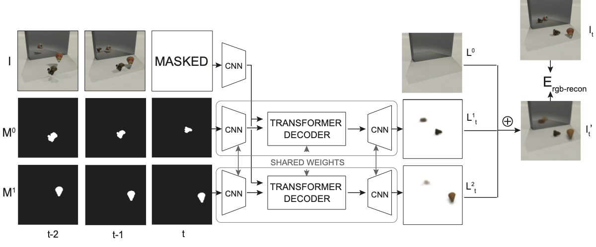

# Omnimatte-SP in JAX/Haiku

This repository contains a reimplementation of the NeurIPS 2022 paper "[Associating Objects and Their Effects in Video Through Coordination Games](https://omnimatte-sp.github.io/)."



This is not an officially supported Google product.


## Prerequisites
- Linux
- JAX [0.4.1]
- Haiku [0.0.9]
- NVIDIA GPU + CUDA CuDNN

## Installation
This code has been tested with JAX 0.4.1, Haiku 0.0.9 and Python 3.10.8.

Install dependencies using [Conda](https://conda.io/projects/conda/en/latest/index.html):

```
conda env create -f environment.yml
conda activate omnimatte-sp
```

## Data
Download and extract the datasets used in our paper:

```bash
./scripts/dldata.sh
```

## Training
- For an example of pretraining on synthetic data and fine-tuning on a synthetic
 test video, run:

```bash
./scripts/train-synth.sh
```
- For an example reproducing a real video in the paper, see ```scripts/train-real.sh```

- To view Tensorboard visualizations, run:

```bash
tensorboard --logdir=checkpoints/vis --port=8097
```
and visit the URL http://localhost:8097.
Models and final results are saved to `checkpoints/`.


## Pretrained weights
Download the pretrained weights:

```
./scripts/dlweights.sh
```
Weights will be saved to ```pretrained_weights/```.

For an example of running inference using the pretrained weights, see ```scripts/inference.sh```.


## Evaluation
For an example of running the evaluation code, see ```scripts/eval.sh```.


## Custom video
To finetune on a custom video, follow the preprocessing steps:

1. Stabilize the video.
1. Resize the video to `224x128` and save the frames to `<my_video>/rgb/*.png`.
1. Place object masks in `<my_video>/mask/01/*.png`, `<my_video>/mask/02/*.png`, etc.
1. Estimate the background and save it as `<my_video>/bg_est.png`.
1. [Optional] Specify a per-frame compositing order for the mask layers at `<my_video>/order.txt`. Otherwise layers will be composited back-to-front, starting with `mask/01`.


## Citation
If you use this code for your research, please cite the following paper:

```
@inproceedings{lu2022,
  title={Associating Objects and Their Effects in Video Through Coordination Games},
  author={Lu, Erika and Cole, Forrester and Dekel, Tali and Xie, Weidi and Zisserman, Andrew and Freeman, William T and Rubinstein, Michael},
  booktitle={NeurIPS},
  year={2022}
}
```
